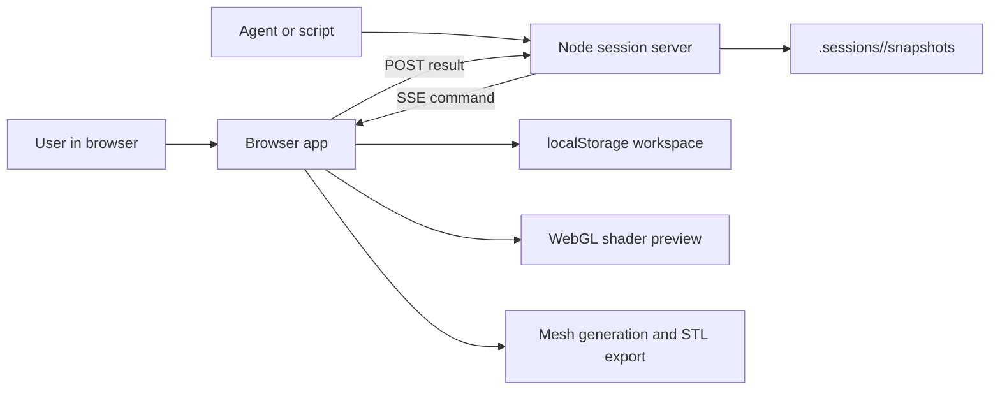
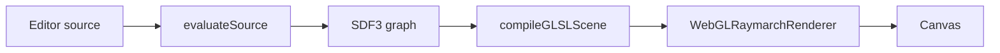
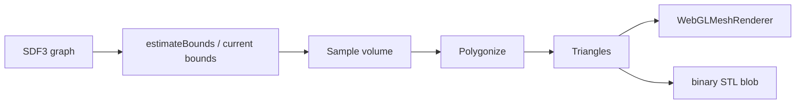
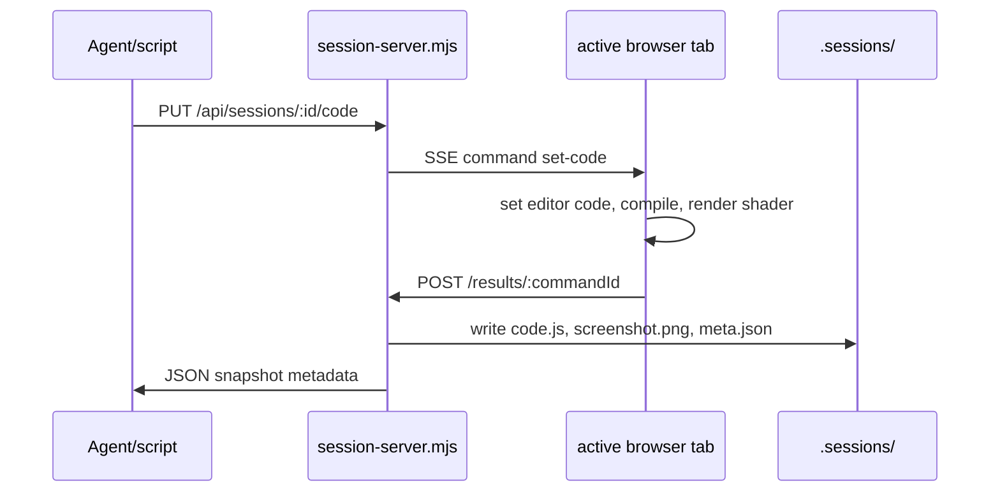

# Architecture

This document describes the active browser-native architecture for `sdf browser`. The repository is derived from Michael Fogleman's original Python [`sdf`](https://github.com/fogleman/sdf) project, but the legacy Python package has been removed from this tree. The product architecture described here is the root-level npm app.

## System Shape

`sdf browser` has two cooperating runtimes:

- A Node/Vite session server in `session-server.mjs`
- Node-only server helpers in `server/`
- Static HTML/CSS shells in `static/`
- A browser app in `src/` that owns editing, graph state, rendering, mesh generation, local saves, and browser-session command handling

The server deliberately does not render or evaluate SDFs. It serves the app, routes session API requests, relays commands to the active browser tab over Server-Sent Events, and persists session snapshots under `.sessions/`.

Vite serves `static/` as the web root through `server/static-app.mjs`, so URLs like `/checks.html` stay flat while source entrypoints resolve through a `/src` alias to the root TypeScript tree. That keeps static page shells separate from implementation code and keeps `.sessions/` outside the served static root.

## Source To Shape

The editor source is plain JavaScript executed with the SDF API and `Math` injected as globals.

1. `src/editor/evaluate-source.ts` builds a runtime object from `src/api/index.ts`.
2. The source is executed with `new Function(...)`.
3. The direct return value must be an `SDF3`. If no top-level return exists, `source-auto-return.ts` tries to return the final expression.
4. API calls create an SDF graph of `Node` objects rather than immediately sampling geometry.
5. `source-compile-controller.ts` stores the current valid `activeSdf`; `graph-interaction-controller.ts` refreshes source links, updates the graph inspector, restores graph selection, and manages graph-visible state. The preview viewport then invalidates mesh state and schedules a shader preview.

Important data types live in `src/core/nodes.ts`:

- `SDF2` and `SDF3` are wrappers around graph `Node`s.
- Each `Node` has a `kind`, `params`, `children`, `dim`, and current-graph runtime `id`.
- CSG and transforms are represented as nodes, so the same graph can feed editor inspection, GLSL/WGSL compilation, CPU evaluation, and mesh generation.

## Browser App Responsibilities

`src/main.ts` is the browser app coordinator. It wires typed app element groups, Monaco, graph inspection, renderers, mesh building, document persistence, and session commands.

The major state buckets are:

- Source state: current editor text, compile validity, source links, diagnostics, selected source link
- Graph state: `activeSdf`, selected or hovered graph node, hidden nodes, graph edit history
- Preview state: current bounds, raymarch step count, preview layout, shader or mesh mode
- Mesh state: grid size, mesh algorithm, generated triangles, last STL blob
- Workspace state: saved documents, versions, draft source, preview settings
- Session state: active session id, SSE connection, command status, snapshot count

The app is intentionally client-heavy: after the page loads, source evaluation, preview rendering, mesh generation, and saves all happen in the browser.

Common editor interaction policy lives outside the coordinator where possible:

- `src/editor/app-elements.ts` owns required DOM selector lookup and groups elements by the controller that consumes them.
- `src/editor/app-frame.ts` owns browser-frame deferral helpers shared by app wiring, source dialog focus restoration, and session screenshot capture.
- `src/editor/app-health.ts` owns health diagnostics exposure, monitor state, diagnostic assembly, and DOM control summaries; `main.ts` supplies the live app state snapshot.
- `src/editor/app-shortcuts.ts` owns global keyboard shortcut matching, shortcut metadata, and dispatch to app-provided actions.
- `src/editor/app-state-model.ts` owns derived app read-models for health diagnostics, preview rendering state, preview profile persistence, dirty-state updates, and before-unload checks.
- `src/editor/browser-session-bridge.ts` owns app-specific browser-session command handlers for status reads, agent code updates, screenshot capture, and manual snapshot state.
- `src/editor/browser-session-controller.ts` owns browser-session strip interactions and status labels.
- `src/editor/editor-view-controller.ts` owns code/graph view switching, mode button state, panel visibility, and selected-target reveal button behavior.
- `src/editor/graph-edit-model.ts` owns shared graph param paths, edit payloads, dirty-param payloads, and path mutation helpers used by the inspector, source patcher, and graph history.
- `src/editor/graph-param-model.ts` owns numeric param discovery, orientation matrix helpers, matrix cell paths, slider bounds, step sizing, and numeric formatting used by the graph inspector.
- `src/editor/graph-visibility.ts` owns graph visibility state metadata, visibility icons, node lookup/path helpers, hidden-subtree calculations, and isolate-visible set construction.
- `src/editor/graph-history-controls.ts` owns graph history button state, undo/redo/reset orchestration, dirty-param publishing, and the graph change journal shell.
- `src/editor/graph-interaction-controller.ts` owns graph/source-link selection, hover/focus/solo preview state, hidden-node state, source-link refresh, graph edit source sync, and graph-history interaction callbacks.
- `src/editor/preview-bounds-controller.ts` owns preview bounds state, bounds editor validity, example/profile bounds application, and fit-to-SDF behavior.
- `src/editor/preview-profile.ts` owns saved preview profile construction, snapshot comparison, bounds cloning, and hidden-node identity mapping.
- `src/editor/source-editor-controller.ts` owns source-editor commands around graph hints, prettify, source-link clearing during edits, and debounced compile scheduling; compile execution is delegated to `source-compile-controller.ts` through app wiring.
- `src/editor/source-compile-controller.ts` owns source evaluation, source-link discovery for compiled graphs, active SDF validity, diagnostic failure handling, and preview invalidation after successful compiles.
- `src/editor/source-language-features.ts` owns Monaco JavaScript language providers for API completions, formatting, hover docs, signature help, SDF quick fixes, graph source-link inlay hints, and inlay-hint command routing.
- `src/editor/source-workspace-session.ts` owns active source document identity, document-name UI state, dirty/save state, and draft persistence.
- `src/editor/source-workspace-actions.ts` owns source load dialog rendering, example/saved-source load commands, save/delete commands, and draft restoration; `main.ts` supplies callbacks for graph, bounds, preview, and compilation side effects.
- `src/preview/preview-viewport-controller.ts` owns preview renderers, shader/mesh mode controls, preview layout labels, step/grid controls, mesh job state, STL download state, and debounced render scheduling; `main.ts` supplies the current graph, bounds, document name, and highlight policy.

## Source Links And Graph Editing

The editor and graph inspector stay connected through source links:

- `editor/clean-source-patch.ts` finds links between source ranges and graph node params.
- `editor/code-editor.ts` renders those links in Monaco and reports selections or value edits.
- `editor/graph-edit-model.ts` provides the shared edit/path model so source patching, graph history, and graph inspector UI do not import each other for data shapes.
- `editor/graph-param-model.ts` provides pure numeric-param and orientation-matrix helpers so the graph inspector can stay focused on rendering controls and handling DOM interaction.
- `editor/graph-visibility.ts` provides pure graph lookup and visibility-set helpers plus visibility control metadata/icons.
- `editor/graph-inspector.ts` shows the graph and allows node selection, visibility changes, solo/focus preview, and numeric param edits.
- `editor/graph-history.ts` records graph edit undo/redo entries.
- `editor/graph-history-controls.ts` connects that history model to toolbar controls, reset behavior, dirty graph highlights, and journal callbacks supplied by `main.ts`.
- `editor/graph-interaction-controller.ts` coordinates source-link selection, graph hover, graph-history hover/select, hidden-node persistence, and source patching for graph edits.
- `editor/graph-source-identity.ts` helps restore selection across recompiles when node ids change.
- `editor/source-language-features.ts` registers graph source-link inlay hints and routes inlay-hint selections back into the active editor instance.
- `editor/source-link-matching.ts` owns shared source-link equality, node/edit lookup, and compact labels used across the editor.

Graph edits patch source instead of mutating long-lived graph objects. The source remains the durable user artifact, and recompilation rebuilds the graph.

## Preview Pipeline

The default preview is a WebGL raymarcher.

Key pieces:

- `src/glsl/compiler.ts` emits one GLSL distance function per graph node and a final `scene(vec3 p)`.
- `src/preview/webgl-raymarch-renderer.ts` compiles that GLSL into a WebGL2 preview program.
- `src/preview/orbit-camera.ts` owns shared orbit camera state for shader and mesh views.
- `src/preview/view-layout.ts` defines single and multi-panel view layouts.
- `src/preview/preview-viewport-controller.ts` owns renderer initialization, shader/mesh mode switching, layout labels, debounced shader renders, and session screenshot rendering.
- `main.ts` supplies the visible graph, solo/focus render graph, highlight mode, bounds, and document state to the preview viewport controller.

The preview is debounced during typing. Session screenshot capture forces shader mode, flushes the pending preview timer, renders the current valid graph, waits for a browser frame, and then reads the canvas as PNG data.

## Mesh Pipeline

Mesh view and STL export use the same generated triangle data.

Key pieces:

- `src/mesh/bounds.ts` estimates or pads bounds. The UI can override bounds manually.
- `src/mesh/generate.ts` resolves grid dimensions, samples the field, polygonizes the volume, and returns `MeshResult`.
- `src/gpu/sampler.ts` samples the SDF volume with WebGPU when available.
- CPU sampling falls back to `evaluate3` from `src/evaluate/`.
- Polygonization uses `surface-net` by default or `tetra` when selected.
- `src/mesh/polygonize-worker.ts` runs polygonization in a Web Worker when available.
- `src/preview/webgl-mesh-renderer.ts` renders generated triangles.
- `src/mesh/stl.ts` writes binary STL output.
- `src/preview/preview-viewport-controller.ts` owns mesh build invalidation, build-job cancellation, mesh stats, mesh highlighting, mesh-mode switching, and STL download wiring.

Mesh generation is on demand. Editing source or changing relevant settings invalidates the mesh; the shader preview remains the fast feedback path.

## Browser Session Architecture

Browser sessions are local collaboration channels identified by URLs like `/s/<session-id>`.

Server-side responsibilities in `session-server.mjs`:

- Create or resume session metadata
- Serve `/s/<session-id>` app pages
- Expose `/api/sessions/<session-id>/connect.md`
- Maintain connected browser clients through `GET /events`
- Relay commands with timeout handling
- Persist snapshots under `.sessions/<session-id>/snapshots/<number>/`
- Serve snapshot source and screenshot files
- Restore earlier code snapshots through `/undo`

The route host delegates static app concerns to `server/static-app.mjs`, which owns the Vite middleware-mode server, known static HTML shells, `/src` alias, and private-path guard for `.sessions/`. The generated connection guide lives in `server/connect-markdown.mjs`, keeping the long agent-facing Markdown reference out of the route and snapshot code.

Browser-side responsibilities are split between `src/editor/browser-session.ts`, `src/editor/browser-session-controller.ts`, `src/editor/browser-session-bridge.ts`, and `main.ts`:

- `browser-session.ts` derives the session id from the current `/s/<session-id>` route, connects to the server with `EventSource`, executes `get-status`, `get-code`, `set-code`, and `capture-screenshot`, and posts command results back to the server.
- `browser-session-controller.ts` owns the session strip, copied agent prompt, snapshot count refresh, connection status labels, and manual snapshot POSTs.
- `browser-session-bridge.ts` adapts those generic session commands to the live browser app by reading health/source state, applying agent code updates, rendering shader screenshots, and returning snapshot payloads.
- `main.ts` wires the bridge to the app controllers without owning the session command protocol.

The active browser tab is the source of truth for rendered state. The server only persists what the tab reports.

## Persistence

There are two persistence layers:

- Browser workspace persistence in `localStorage`
- Session snapshots on disk under `.sessions/`

Workspace persistence is stored by `src/editor/workspace-storage.ts`. It writes and reads saved source documents, versions, draft source, preview bounds, mesh grid, ray steps, mesh algorithm, layout, and hidden graph node keys. `src/editor/source-workspace-session.ts` coordinates the active document/version identity, clean snapshots, document-name input, dirty indicator, save button state, and draft synchronization. `src/editor/source-workspace-actions.ts` coordinates the source load/save/delete commands around that session state and delegates app-specific graph, bounds, preview, and compilation updates back to `main.ts`. `src/editor/preview-profile.ts` prepares preview settings for save/load and restores hidden graph nodes through stable source identities.

Session snapshot persistence is implemented in `session-server.mjs`. Snapshot folders can contain:

- `meta.json`
- `code.js`
- `screenshot.png`

The `.sessions/` directory is local-only and ignored by git.

## Verification

The app has focused verifier pages plus TypeScript checks:

- `npm run check` runs the standard CI/local gate: TypeScript, live browser verification, and production build
- `npm test` runs `tsc --noEmit`
- `npm run build` type-checks and builds the Vite app
- `npm run verify:live` runs on Node 22 or newer, starts a temporary Vite server, launches headless Chrome or Chromium through the DevTools Protocol, and runs the full browser verifier suite
- `checks.html` links the manual browser verifier dashboard
- `api-check.html` checks API fixtures, CPU evaluation, GLSL/WGSL compilation, and workflow helpers
- `app-health-check.html` checks editor readiness and non-destructive app health diagnostics
- `editor-check.html` checks Monaco/source-link/editor integration behavior
- `graph-check.html` checks graph inspector controls, graph editing, storage, dialogs, and history behavior
- `mesh-check.html` checks worker mesh generation and STL output
- `preview-check.html` checks shader and mesh preview rendering
- `examples-visual-check.html` renders all bundled examples and checks for nonblank visual output

Health diagnostics are exposed and assembled from `src/editor/app-health.ts`, with app state read from `main.ts`.

## Extension Points

When adding a new SDF operation or primitive, update the graph-centered pipeline end to end:

1. Add the API builder in `src/api/`.
2. Add the node kind and method/global wiring in `src/core/nodes.ts` if needed.
3. Add CPU evaluation support in `src/evaluate/`.
4. Add GLSL compilation support in `src/glsl/compiler.ts`.
5. Add WGSL compilation support in `src/wgsl/compiler.ts` when mesh/WebGPU paths need it.
6. Add API reference/completion data in `src/editor/api-reference-data.ts`.
7. Add user-facing docs in `docs/API.md`.
8. Add focused examples or verifier coverage.

When adding session behavior, keep the same relay model: the server should request state from the active browser tab, and the tab should remain responsible for compiling, rendering, and screenshot capture.

## Design Constraints

- The source code is the durable modeling artifact.
- The SDF graph is the shared intermediate representation.
- Rendering should stay responsive while typing, so shader preview is debounced and mesh generation is explicit.
- Mesh generation should prefer WebGPU and workers, but must keep CPU and synchronous fallbacks.
- The session server should stay local, simple, and renderer-agnostic.
- Snapshot trails should include comments that explain why a command or capture happened.
